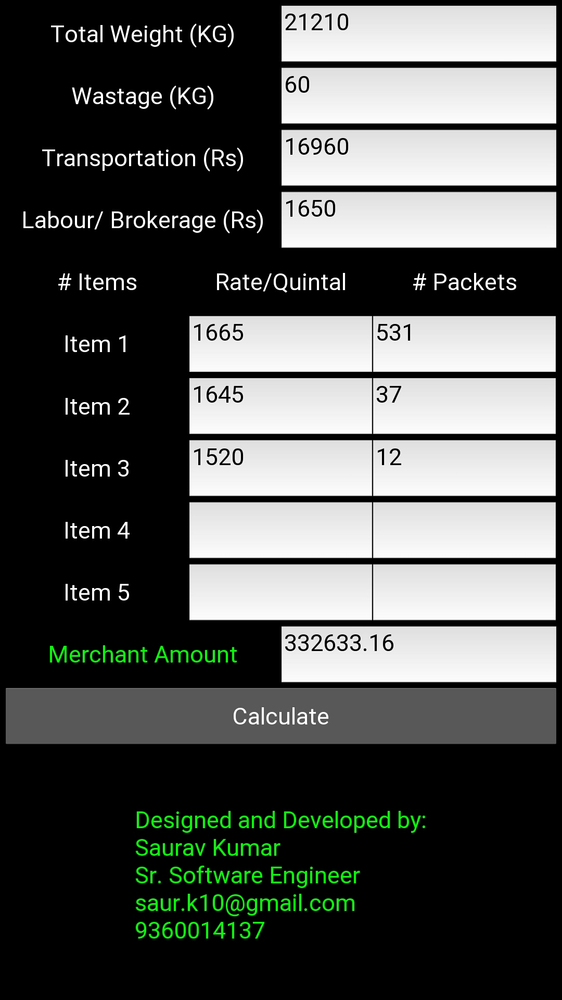

     

          
     

# Galla Merchant Calculator

A popular calculator for Galla merchant which can save hours of their calculations
1. This calculator can be used by merchants, brokers who buy goods from farmers and distribute it to wholesalers.
2. Merchants had to calculate the total money they need to give to farmers.
3. But the calculation is time consuming and keep increasing as per the no. of vehicle and the quantity/rate of the goods

## Installation Guide

### 1. Install global dependencies

     sudo apt-get install virtualenv python-pip

For more details see the kivy installation in virtualenv:

https://kivy.org/docs/installation/installation-linux.html#installation-in-a-virtual-environment

Note: I recommend to install buildozer==0.32, Cython==0.23.1 and kivy==1.9.1 for this app.

### 2. Upgrade `pip` and `setuptools` that are bundled with the OS to the latest stable versions.

     sudo -H pip install pip -U
     sudo -H pip install setuptools -U

### 3. Clone the kivymercal from github to your preferred directory.

    git clone https://github.com/sauravmahuri2007/kivymercal.git
    cd kivymercal

### 4. Create virtualenv and install project dependencies

    virtualenv venv
    source venv/bin/activate
    pip install -r requirements.txt
    # ignore these steps if you already created a virtualenv in 1st step.

### 5. Run the app

    python main.py
    
## Create an apk file using Buildozer

Refer buildozer installation documentation (installing buildozer in virtualenv is recommended):

http://buildozer.readthedocs.io/en/latest/installation.html

Note: following steps can be used to install buildozer in virtualenv:

    virtualenv buildozerenv
    source buildozerenv/bin/activate
    pip install buildozer==0.32 Cython==0.23.1
    
Also make sure to chance the `requirements = kivy` to `requirements = kivy==1.9.1` in `buildozer.spec` file created after `buildozer init`

## Run this app in Android using kivylauncher

Using kivylauncher run this app in android mobiles without installing any extra packages (except kivylauncher)

### Check the below link for installing kivylauncher and how to run the app:

https://kivy.org/docs/guide/packaging-android.html#packaging-your-application-for-the-kivy-launcher
    
### More details about kivylauncher can be found in below github repo:

https://github.com/kivy/kivy-launcher

